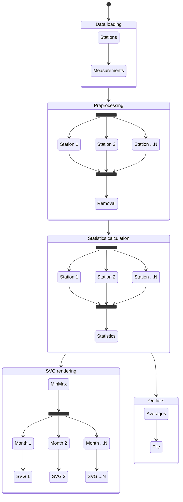

# Meteodata processing

## Building

```sh
mkdir -p build
cmake -DCMAKE_BUILD_TYPE=Release -S . -B build
cmake --build build
```

or

```sh
just configure_release build
```

with the [just](https://github.com/casey/just) command runner.

### Build options

`PERF_TEST_MACRO` – if defined (in CMakeLists.txt), builds the binary in
performance testing mode (see [Performance testing mode](#performance-testing-mode)
below).

## Running

```sh
build/meteo --parallel|--serial path/to/stanice.csv path/to/mereni.csv
```

## Documentation

### Analysis

Generally, I first tried to write the serial version in a reasonably optimized
manner to have a good baseline for comparison. Also, I structured the code in
a way that leans heavily into ranges and higher-order functions (map, reduce, …)
that, besides being clean and fast by themselves, also allow for straightforward
parallelization later.

Furthermore, I split the program into four parts:

- data loading
- preprocessing
- calculating statistics
- outliers detection
- rendering the visualization

They have roughly the following flow:



#### Data loading

The simplest part of the program – reads the file line-by-line, splits each line,
and saves the data to a vector of Stations structs. Reading one file is hard to
parallelize since it involves a lot of small operations using temporary buffers
that would have to be copied into the threads, making them costly. Due to that,
I left it serial.

#### Preprocessing

Preprocessing basically needs to run a check for every station and then remove
the stations that don't pass the check. This allows for all the stations to be
checked in parallel, but the (comparatively fast) removal is better done later
serially to prevent excessive locking.

#### Calculating statistics

In this part the average, minimum, and maximum temperatures are calculated for
each month for each station. This is again independent for each station, so can
be done in parallel.

#### Outliers detection

Here we take the statistics from the previous part and check them for outliers.
This may be done in parallel for each station, but testing showed it was not
worth it. However, it helped to run the serial version on a background thread
while executing the rest of the program as nothing depends on this.

#### SVG rendering

Again, this part consists of a bunch of independent tasks, although this time
for each month rather than each station. It is also beneficial to parallelize
the file access since the compute part can run while another thread is waiting
for a file to finish writing to the drive.

### Implementation

To simplify the parallel implementation, I structured the serial code already
into an easily parallelizable functional range-based paradigm and subsequently
created abstractions building upon these principles.

As an example, in the serial version of preprocessing I wrote:

```cpp
for (auto [i, valid] :
    std::views::transform(stations, valid_station) |
        views::enumerate |
        views::reverse
) {
  if (!valid) {
    swap_remove(stations, i);
  }
}
```

So in the parallel version, I just swapped the range adapter for a parallel
implementation[^standard]:

```cpp
for (auto [i, valid] :
    parallel_transform(stations, valid_station) |
        std::views::enumerate |
        std::views::reverse
) {
  if (!valid.get()) {
    swap_remove(stations, i);
  }
}
```

The overall code structure is nearly identical, but it runs in parallel
and around 1.6 times faster on the laptop (see below).

Internally, they just iterate over the range, create a future for each element,
and wait for all the futures to resolve.

#### Threadpool

After creating the parallel abstraction, I noticed that they spawn hundreds of
threads, usually for quite small tasks, making the thread creation and deletion
a major part of the runtime. So I implemented a basic threadpool and altered the
parallel abstractions slightly to use it instead. This resulted in a major
speedup, making the snippet shown above over 2.5 times faster than the serial
version instead.

#### Performance testing mode

To improve the precision of the time measurements while debugging and measuring
the runtime, I added a `PERF_TEST_MACRO` compile-time option that adds code to
run individual parts of the code multiple times and print the average time.

### Results

For total runtime, I decided to omit the data loading part. It takes around
~~1500~~ ~~800~~ ~~600~~ ~~300~~ 220 milliseconds and is both hard to parallelize
and strongly dependent on the OS and hard drive, while all the “interesting”
parallelizable processing takes in total less than ~~100~~ ~~40~~ 20 milliseconds
(that is around 5% of the total runtime).

Tested devices were:

- laptop: Intel i7-1165G7 (4 cores/8 threads)
- desktop: AMD Ryzen 7 5800X (8 cores/16 threads)

Both are running on GNU/Linux 6.13 with clang++ v19.1.7, so the software
environment should be fairly comparable.

Overall results:

| device  | serial [ms] | parallel [ms] | speedup |
| ------- | ----------: | ------------: | ------: |
| laptop  |    16.5±1.8 |       6.1±0.6 |    2.70 |
| desktop |    13.8±0.7 |       7.2±0.2 |    1.92 |

Interestingly, in the earlier version the laptop was overall 2 times slower in
the serial version and 1.5 times in the parallel. However, after a lot of
iterations the laptop, which is on paper much slower[^slower] than the desktop,
got faster and faster eventually outperfoming the desktop. I tried to remove as
much of external variables as possible, like replacing the actual drive with
a RAM disk, but the results only got more amplified in the “wrong” direction.

I frankly have no idea how this could happen since in the CSV parsing and in
other CPU-bound (both single and multicore) tasks the desktop is significantly
(over 2 times) faster. If I had to guess, I would say that the main cause is the
already short runtime of the serial version, leaving very few opportunities for
improvement and outsized impact of random performace fluctuations due to
OS scheduling, IO, etc.

EDIT: After few more days of investigation, I found out that the laptop has
slightly higher clocked RAM which may be a part of the reason it's faster. It
lines up with the fact that it got more visible in the parallel version where
data is being copied between threads and also when measuring with RAM disks.

While debugging, I also noted down the runtimes of the individual parts of the
program (see [Performance testing mode](#performance-testing-mode)). I include
them here for reference and for comparison with the results above.

| part                | device  | serial [μs] | parallel [μs] | speedup |
| ------------------- | ------- | ----------: | ------------: | ------: |
| preprocessing       | laptop  |        5927 |          2026 |    2.93 |
|                     | desktop |        4300 |          3028 |    1.42 |
| stats               | laptop  |        6554 |          2085 |    3.14 |
|                     | desktop |        5176 |          2561 |    2.02 |
| outliers[^outliers] | laptop  |         780 |           798 |    0.98 |
|                     | desktop |         832 |           832 |    1.00 |
| rendering           | laptop  |        1766 |           930 |    1.90 |
|                     | desktop |        1443 |           546 |    2.64 |

#### Metrics

##### Parallelization efectivity

Compares the achieved speedup with number of used cores:

$$
\eta = \frac{S}{s}
$$

For the laptop this is results in:

$$
\eta = \frac{2.70}{4} = 0.68
$$

For the desktop this results in:

$$
\eta = \frac{1.92}{8} = 0.24
$$

##### Amdahl's law

According to Amdahl's law, the maximum theoretical speedup can be approximated
as:

$$
\text{speedup} = \frac{1}
    {(1 - \text{parallelizable}) + \frac{\text{parallelizable}}{\text{cores}}}
$$

Approximating from `perf` measurements[^perf-approximation], the whole processing
is (in theory) around 85% parallelizable[^csv-time].

So for the laptop, I get:

$$
\text{speedup} = \frac{1}{(1 - 0.85) + \frac{0.85}{4}} = 2.76
$$

Which is remarkably close to the measured speedup of $2.70$. On the other hand,
for the desktop the theory predicts:

$$
\text{speedup} = \frac{1}{(1 - 0.8) + \frac{0.8}{8}} = 3.9
$$

Which is way more than the measured speedup of $1.92$.

##### Gustafson's law

Gustafson's law is defined as:

$$
\text{speedup} = (1 - a)P + a
$$

For the laptop:

$$
\text{speedup} = (1 - 0.85)4 + 0.85 = 1.45
$$

And for the desktop:

$$
\text{speedup} = (1 - 0.85)8 + 0.85 = 2.5
$$

Which both have seemingly no relation to the measured values whatsoever.

[^standard]: Custom made but similar to the parallel standard library.

[^outliers]:
    This part wasn't directly parallelized, only ran in a “background thread” in
    the parallel version. Included just for the sake of completeness.

[^slower]:
    Compared to the desktop it has: half of the cores, lower boost clock speed
    (4.7 vs 4.85 GHz), smaller caches (12 vs 32 MB L3), weaker power delivery,
    and weaker cooling.

[^perf-approximation]:
    How much time relatively was spent in the serial version on the tasks that
    were later successfully parallelized as measured by `perf`. E.g. preprocessing
    spends 98% of the time validating the stations (parallelizable) and 2% on
    removing them from the vector (not parallelizable), thus being 98%
    parallelizable.

[^csv-time]:
    If CSV parsing was included, it would be only 3% parallelizable, which
    in my opinion defeats the purpose of the exercise.
