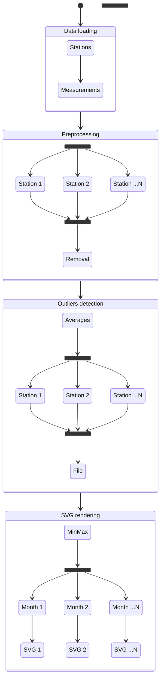

# Meteodata processing

## Building

```sh
mkdir -p build
cmake -DCMAKE_BUILD_TYPE=Release -S . -B build
cmake --build build
```

or

```sh
just configure_release build
```

With the [just](https://github.com/casey/just) command runner.

### Build options

`PERF_TEST_MACRO` – if defined (in CMakeLists.txt), builds the binary in
performance testing mode (see [Performance testing mode](#performance-testing-mode)
below).

## Running

```sh
build/meteo --parallel|--serial path/to/stanice.csv path/to/mereni.csv
```

## Documentation

### Analysis

Generally, I first tried to write the serial version in a reasonably optimized
manner to have a good baseline for comparison. Also, I structured the code in
a way that leans heavily into ranges and higher-order functions (map, reduce, …)
that, besides being clean and fast by themselves, also allow for straightforward
parallelization later.

Furthermore, I split the program into four parts:

- data loading
- preprocessing
- outliers detection
- rendering the visualization

They have roughly the following flow:



#### Data loading

The simplest part of the program – reads the file line-by-line, splits each line,
and saves the data to a vector of Stations structs. Reading one file is hard to
parallelize since it involves a lot of small operations using temporary buffers
that would have to be copied into the threads, making them costly. Due to that,
I left it serial.

#### Preprocessing

Preprocessing basically needs to run a check for every station and then remove
the stations that don't pass the check. This allows for all the stations to be
checked in parallel, but the (comparatively fast) removal is better done later
serially to prevent excessive locking.

#### Outliers detection

Here we have to first calculate the average temperatures and then use them to
find outliers. Both are quite intuitively parallelizable since they are again
independent for each station.

Only potential pitfall is the collection of the outliers into one vector. It can
either be done with one vector synchronized using a mutex lock (direct port of
the serial version) or by producing a vector for each station and then
synchronously merging them into one large vector. Testing both showed that they
are roughly similar in performace, so I chose the latter since it can reuse more
code from the serial version.

#### SVG rendering

Again, this part consists of a bunch of independent tasks, although this time
for each month rather than each station. It is also beneficial to parallelize
the file access since the compute part can run while another thread is waiting
for a file to finish writing to the drive.

### Implementation

To simplify the parallel implementation, I structured the serial code already
into an easily parallelizable functional range-based paradigm and subsequently
created abstractions building upon these principles.

As an example, in the serial version of preprocessing I wrote:

```cpp
for (auto [i, valid] :
    std::views::transform(stations, valid_station) |
        views::enumerate |
        views::reverse
) {
  if (!valid) {
    swap_remove(stations, i);
  }
}
```

So in the parallel version, I just swapped the range adapter for a parallel
implementation[^standard]:

```cpp
for (auto [i, valid] :
    parallel_transform(stations, valid_station) |
        std::views::enumerate |
        std::views::reverse
) {
  if (!valid.get()) {
    swap_remove(stations, i);
  }
}
```

The overall code structure is nearly identical, but it runs in parallel
and around 2 times faster[^laptop].

#### Threadpool

After creating the parallel abstraction, I noticed that they spawn hundreds of
threads, usually for quite small tasks, making the thread creation and deletion
a major part of the runtime. So I implemented a very basic threadpool and
altered the parallel abstractions slightly to use it instead of `std::thread`.
This resulted in major speedups, making the snippet shown above around 2.8 times
faster than the serial version[^laptop].

#### Performance testing mode

To improve the precision of the time measurements, I added a `PERF_TEST_MACRO`
compile-time option that adds code to run individual parts of the code multiple
times and print the average time.

### Results

For total runtime, I decided to omit the data loading part since it takes
between 1200 and 1300 milliseconds, while all the “interesting” processing
takes in total less than 30 milliseconds (that is less than 3% of the runtime).

Tested devices were:

- laptop: Intel i7-1165G7 (4 cores/8 threads)
- desktop: AMD Ryzen 7 5800X (8 cores/16 threads)

Both are running on GNU/Linux 6.12 with clang++ v19.1.7, so the software side
should be fairly comparable.

Overall results:

| device  | serial [ms] | parallel [ms] | speedup |
| ------- | ----------: | ------------: | ------: |
| laptop  |          27 |            13 |    2.08 |
| desktop |          14 |             7 |       2 |

Split by parts (with `PERF_TEST_MACRO` enabled):

| part          | device  | serial [μs] | parallel [μs] | speedup |
| ------------- | ------- | ----------: | ------------: | ------: |
| preprocessing | laptop  |        6063 |          2200 |    2.75 |
|               | desktop |        4311 |          3145 |    1.37 |
| outliers      | laptop  |        7068 |          2900 |    2.44 |
|               | desktop |        6296 |          2930 |    1.79 |
| rendering     | laptop  |        6669 |          1947 |    3.43 |
|               | desktop |        2588 |           671 |    3.86 |

Interestingly, while the desktop was faster overall, the performance difference
varies noticeably between the parts of the program. Also, surprisingly, the
speedups from parallelization are overall much more noticeable on the laptop,
which has half as many cores. I suspect that large part of that is due to
external factors (mainly the disk latency when writing the files) that are
overrepresented in the short overall runtime.

#### Metrics

##### Parallelization efectivity

Compares the achieved speedup with number of used cores:

$$
\eta = \frac{S}{s}
$$

For the laptop this is results in:

$$
\eta = \frac{2.08}{4} = 0.52
$$

For the desktop this results in:

$$
\eta = \frac{2}{8} = 0.25
$$

##### Amdahl's law

According to Amdahl's law, the maximum theoretical speedup can be approximated
as:

$$
\text{speedup} = \frac{1}
    {(1 - \text{parallelizable}) + \frac{\text{parallelizable}}{\text{cores}}}
$$

Approximating from `perf` measurements[^perf-approximation]:

- preprocessing is 92% parallelizable
- outlier detection is 88% parallelizable
- rendering is 99% parallelizable

<!-- TODO: recompute the parallelization -->

That means the whole processing is (in theory) 82.8% parallelizable (weighted
average of the above).

So for the laptop, I get:

$$
\text{speedup} = \frac{1}{(1 - 0.828) + \frac{0.828}{4}} = 2.64
$$

Which is, as expected, more than the measured speedup of $2.08$, but not that far
off. However, for the desktop, I get:

$$
\text{speedup} = \frac{1}{(1 - 0.828) + \frac{0.828}{8}} = 3.63
$$

Which is way more than the measured speedup of $1.72$.

##### Gustafson's law

Gustafson's law is similar to Amdahl's:

$$
\text{speedup} = (1 - a)P + a
$$

For the laptop:

$$
\text{speedup} = (1 - 0.828)4 + 0.828 = 1.52
$$

And for the desktop:

$$
\text{speedup} = (1 - 0.828)8 + 0.828 = 2.2
$$

[^standard]:
    Custom made, because the standard library parallel algorithms have poor
    support across compilers.

[^laptop]: On the laptop with Intel i7-1165G7 (4 cores/8 threads)

[^perf-approximation]:
    That means, how much time relatively was spent in the serial version on the
    tasks that were later successfully parallelized. E.g. preprocessing spent
    99% of the time validating the stations and 1% on removing them from the
    vector.
