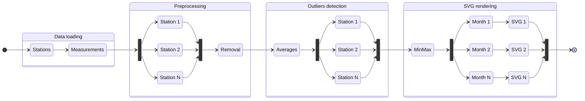

# Meteodata processing

## Building

```sh
mkdir -p build
cmake -DCMAKE_BUILD_TYPE=Release -S . -B build
cmake --build build
```

or

```sh
just configure_release build
```

With the [just](https://github.com/casey/just) command runner.

### Build options

`PERF_TEST_MACRO` – if defined (in CMakeLists.txt), build the binary in
performance testing mode (see below)

## Running

```sh
build/meteo --parallel|--serial path/to/stanice.csv path/to/mereni.csv
```

## Documentation

### Analysis

Generally I first tried to write the serial version in reasonably optimized
manner to have good baseline for comparison. Also, I structured the code in
a way, that leans heavily into ranges and higher-order-functions (HOF) (map,
reduce, …) that besides being clean and fast by themselves also allow for
a straightforward parallelization later.

Furthermore, I split the program into four parts:

- data loading
- preprocessing
- outliers detection
- rendering the visualization

They have roughly the following flow:



#### Data loading

Simplest part of the program, just reads the file line-by-line, splits each line
and saves the data to a vector or Stations structs. Reading one file is very
hard to parallelize, since it involves a lot of very small operations using
temporary buffers, that would have to be copied into the threads making them
quite costly. Due to that, I left it serial.

#### Preprocessing

Preprocessing basically needs to run a check for every station and then remove
the stations that don't pass the check. This allows for all the stations to
be checked in parallel but the (relatively fast) removal is better to be done
later serially to prevent excessive locking.

#### Outliers detection

Here we have to first calculate the average temperatures and then use them to
find outliers. Both are in theory parallelizable (independent tasks for each
station), however the averaging is fast enough serially for the size of the
sample data, making it not worth it to parallelize. On the other hand, the
outlier detection itself is more complex and thus fit for parallelization.

#### SVG rendering

Again this part consists of a bunch of independent task, although this time for
each month rather than each station. It is also very beneficial to parallelize
the file access, since the compute part can run, while another thread is waiting
for a file to finish writing to the drive.

### Implementation

To simplify the parallel implementation I structured the serial code already
into easily paralelizable functional range-based paradigm and subsequentially
created abstractions building upon these principles.

As an example in the serial version of preprocessing I wrote

```cpp
for (auto [i, valid] :
    std::views::transform(stations, valid_station) |
        views::enumerate |
        views::reverse
) {
  if (!valid) {
    swap_remove(stations, i);
  }
}
```

so in the parallel version I just swapped the range adapter for a parallel
implementation[^standard]

```cpp
for (auto [i, valid] :
    parallel_transform(stations, valid_station) |
        std::views::enumerate |
        std::views::reverse
) {
  if (!valid.get()) {
    swap_remove(stations, i);
  }
}
```

The overall code structure is nearly identical, but it runs in parallel and
around 2.1 times faster[^laptop].

#### Threadpool

After creating the parallel abstraction, I noticed, that they spawn hundreds of
threads usually for quite small tasks, making the thread creation and deletion a
major part of the runtime. So I implemented a very basic threadpool and altered
the parallel abstractions slightly to use it instead of `std::thread`. This
resulted in major speedups, making the snippet shown above nearly 3 times
faster than the serial version[^laptop].

#### Performace testing mode

To improve the precision of the time measurements, I added a `PERF_TEST_MACRO`
compile time option, that adds code to run individual parts of the code
multiple times and print the average time.

### Results

For total runtime, I decided to omitt the data loading part since it takes
between 1200 and 1300 milliseconds, while all of the "interesting" processing
takes in total less than 30 milliseconds (that is less than 3% of the runtime).

Test devices were:

- laptop: Intel i7-1165G7 (4 cores/8 threads)
- desktop: AMD Ryzen 7 5800X (8 cores/16 threads)

Overall results:

| device  | serial $[ms]$ | parallel $[ms]$ | speedup |
| ------- | ------------: | --------------: | ------: |
| laptop  |            27 |              13 |    2.08 |
| desktop |            11 |               7 |    1.57 |

Split by parts:

| part          | device  | serial $[μs]$ | parallel $[μs]$ | speedup |
| ------------- | ------- | ------------: | --------------: | ------: |
| preprocessing | laptop  |          6063 |            2200 |    2.75 |
|               | desktop |          4520 |            3261 |    1.40 |
| outliers      | laptop  |          7068 |            2900 |    2.44 |
|               | desktop |          5184 |            2885 |    1.80 |
| rendering     | laptop  |          6669 |            1947 |    3.43 |
|               | desktop |          1412 |             422 |    3.35 |

Interestingly, while the desktop was faster overall the performace difference
varies wildly between the parts of the program. Also the speedups from
parallelization are overall more noticeable on the laptop with fewer cores,
making me think it has something to do with scheduling overhead or different
cache structure.

#### Metrics

##### Amdahl's law

According to the Amdahl's law, the maximum speedup can be approximated
as

$$
\text{speedup} = \frac{1}{(1 - \text{paralelizable}) \cdot
    \frac{\text{paralelizable}}{\text{cores}}}
$$

Aproximating from `perf` measurements

- preprocessing is 99% parallelizable
- outlier detection is 98% parallelizable
- rendering is 60% parallelizable

That means the whole processing is (in theory) 82.8% paralelizable

So for the laptop I get

$$
\text{speedup} = \frac{1}{(1 - 0.828) \cdot \frac{0.828}{4}} = 2.64
$$

which is larger that the measured speedup of 2.08, but not that far off.
However for the desktop I get

$$
\text{speedup} = \frac{1}{(1 - 0.828) \cdot \frac{0.828}{16}} = 3.63
$$

which is way off from the measured speedup of 1.57.

[^standard]:
    Custom made, because the standard library parallel algoritms have poor
    support across compilers.

[^laptop]: On the laptop with Intel i7-1165G7 (4 cores/8 threads)
